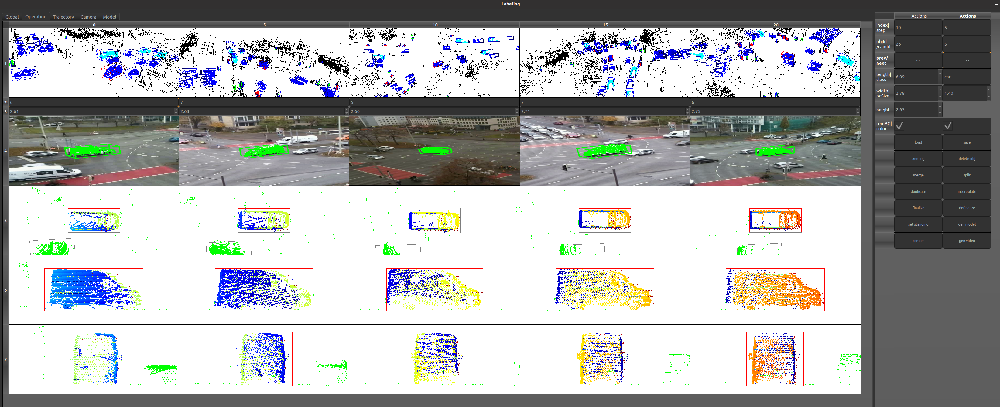
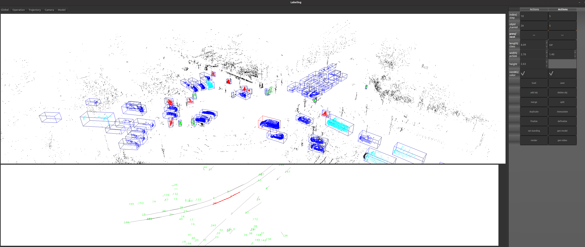
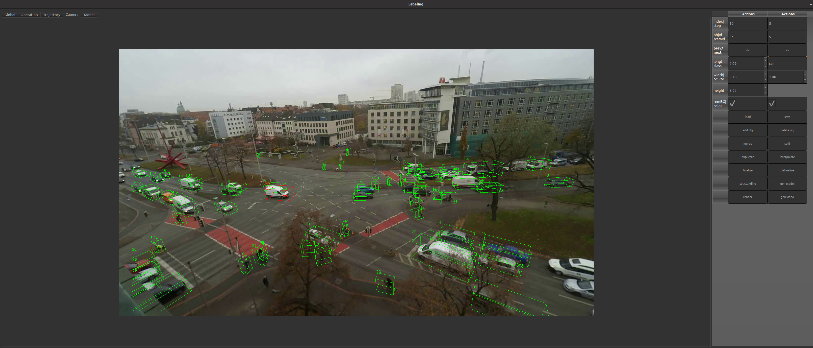

# LUMPI Labeling Tool
<span id="operatin:tab"></span>


This tool is designed to label 3D bounding boxes in a point cloud with the use of different camera perspectives.
It is configured to load the [LUMPI Dataset](https://data.uni-hannover.de/en/dataset/lumpi)  and was used in the [labeling process](https://youtu.be/Ns6qsHsb06E).

## Content
- [Installation](#installation)
- [Usage ](#usage)
- [Adaptation](#adaptation)
- [Usage](#usage)

## Installation
The tool was developed and tested with Ubuntu 20.04, and following dependencies:
- [OpenCV](https://opencv.org/)
- [Point Cloud Library](https://pointclouds.org/)
- [QT](https://www.qt.io/)

You could install all dependencies by using the requirements.txt:
```
xargs sudo apt-get install <requirements.txt
```
Afterwards you could install this software by:

```
$ git clone url
$ mkdir build
$ cd build
$ cmake path
$ make
$ ln -s ../path/data data (optional dark scheme)
$ ./Labeling
```


## Usage
The main purpose of this tool is the correction of object tracks. For each track a rigid bounding box is assumed and for now only a rotation around the Z-axis (yaw/heading) is enabled. 
The tool is ready to start for the lumpi data set and expect following <span id="structure"></span> **structure**:
- ROOT
    - meta.json
    - Measurement**Id**
        - lidar
            - 000000.ply
            - ...
        - cam
            - **deviceId**
                - video.mp4

An general overview is given in this video [tutorial](https://youtu.be/wgPDjPjT0bk).

## Quick Start: LUMPI Test Data  

To get started quickly with the LUMPI test data:  
1. Download [test data](https://data.uni-hannover.de:8080/dataset/upload/users/ikg/busch/LUMPI/test_data.zip)
2. Press the **Load** button.  
3. Choose your **ROOT-directory**.  
4. Enter your **measurementId**.  
5. Select your **Label.csv** file.  

---

Use the operational tabs to inspect and work with the data:  

### **Global View**  
<p float="left">
  
</p>

- Visualize the entire point cloud with its objects in a large point cloud viewer at the top.  
- Get a global view of the trajectories at the bottom.  
- Interact with objects:  
  - **Select objects**: Use Shift + click in the point cloud view or left-click in the trajectory view.  
  - **Add objects**: Click the **addObject** button and pick points in the global view.  

### [**Operational View**](#operatin:tab)
- Visualize a sliding window with multiple views:  
  - **Point cloud viewer**  
  - **Camera viewer**  
  - **Bird’s-eye view**  
  - **Side view**  
  - **Back view** (from the object’s perspective for each time step)  
- Modify bounding boxes:  
  - **Translate position**  
  - **Rotate heading**  
- Use the context menu for additional actions:  
  - Interpolation  
  - Extrapolation  
  - Mark as standing  
  - Mark/delete overlapping boxes  

### **Trajectory View**  
- Inspect the smoothness of your tracks.  
- Navigate to pose anomalies by left-clicking on a specific pose.  

### **Global Camera View**  
<p float="left">
  
</p>

- Observe the entire scene from different perspectives.  
- Select objects by left-clicking.  

### **Model View**  
- Inspect the convex hull for the aggregation of all points within the bounding boxes of a track.  
---


## Best Practice  
**Summary of best practices for different tasks**  

### Track Extension  
How to start labeling your sensor data or extend your labels with new object tracks.  
For our recommendations on efficiently adding new tracks, watch this [tutorial](https://youtu.be/4CFBQkpRbls).  

- Split existing tracks by clicking **split** and defining an offset to the existing track.  
    - Add track with astatic offset in front, behind, left or right of a track with identically boundign box dimension.
    - Split a to big bounding box into two seperate parallel moving objects. 
- Add new objects:  
  - Add objects when they enter the scene.  
  - Jump to the point cloud index where they exit the scene and extrapolate the track.  
  - Interpolate the track.  
  - Go to an index between entry and exit, correct the pose, and interpolate again.  
  - Gradually reduce the step size.  

### Correction  
How to correct tracking errors, track losses, identity switches, and pose jittering for stationary objects.  
For our recommendations on efficiently fixing tracks, watch this [tutorial](https://youtu.be/CB34H1LOCZo).  

- Select the track you want to edit in the **Global** or c**Camera** tab.  
- Switch to the **Operation** tab and begin with a high step size. We recommend:  
  - **Step size 10** for vehicles (1 second).  
  - **Step size 20** for bicycles (2 second).  
  - **Step size 50** for pedestrians (5 second).  
  - Increase the step size if the object is stationary.  
- Review the entire track, focusing on the first and last pose:  
  - If the track is too short, extrapolate it until the object is no longer identifiable in the point cloud.  
  - If the track is too long or identity switches occurred, use the split option to shorten it.  
- Adjust the box dimensions:  
  - Begin at an index where the object is clearly visible.  
  - Verify the dimension size across the entire track, considering the time offset between points.  
- After defining the box size, start pose correction in the **Operation** tab:  
  - Start with a higher step size, interpolate the track, then gradually reduce the step size until the desired frequence is reached.  
  - Use interpolation whenever possible.  
  - Mark stationary intervals by clicking **set standing**.  
  - Adjust the box in bird’s-eye, side, or back views.  
  - Align the heading first for accurate position determination.  
- Check the **Trajectory** tab for inconsistencies, selecting your desired step size.  
- Generate the image mask by aggregating the points of your track:  
  - Click **generate model** (choose suitable start/end indices and step size; this may take time).  
- Verify the bounding box and mask in the **Camera** tab.  
- Review multiple objects and longer sequences by saving a video:  
  - Click **generate video** (choose an appropriate interval and frame rate). 


## Adaptation
Don't hasitate to adapte the code, here we descripe simple adations to adate the toool to your data.

If you want to use different point cloud data you can just adapt the **get_cloud** method, by replacing the parsing line with yout point cloud parser:
<details>
<summary>Code replacement</summary>  

```
# Labeling.cpp Line 532:
---   tmpCloud.second= Parser::load_cloud_ikg_benchmark(ss.str());

    /* Example: replace the loading method with the following code to load a mobile mapping cloud from the institute for Cartography and Geoinformatics:
    tmpCloud.second= Parser::load_cloud_ikg_mobile_mapping("../mobile_mapping/003.ply");
    cv::Point3d center(0,0,0);
	for(auto&p:tmpCloud.second){
		center.x+=p.x;
		center.y+=p.y;
		center.z+=p.z;
	}
	center/=(double)tmpCloud.second.size();
	for(auto &p:tmpCloud.second){
		p.x-=center.x;
		p.y-=center.y;
		p.z-=center.z;
    }
    */
```

</details>
The Parser.cpp class shoulde give you some insperatin of how to wirte your own point cloud parser.
The core functionality is given also for only XYZ information. If you want to change the index scheme, have a closer look to this method.  

We recommend the use of cameras especially for crowdi scenes, identity switches are some time hard to identify by using point clouds only.


For A camera usage the extrinsic and intrinsic for each camera perspective has to be known. The main coordinate frame is the lidar frame and the labels will be also saved in this frame. The camera images are loaded as one video per camera. Expecting the file [structure](#structure).
The camera meta are load from the meta.json:
- Experiment/Measurement id **experimentId**(to identify the rigth subfolder in your **ROOT** directory)
- Camera device id **deviceId** (to identify and find the video)
- Camera intrinsic **intrinsic** (3x3 matrix)
- Camera rotation **rvec** (3x1 vector from lidar to camera)
- Camera translation **tvec** (3x1 vector from lidar to camera)  
- Camera distortion **distortion** (4x1 vector)
- Camera frames per second **fps** (for time synchronization)

### Time synchronisation 
For time synchronisation purposes, it is assumed that all videos start synchronously. For synchronising the time with the LiDAR data, the point clouds are stored with a continuous index, represented by filenames with leading zeros.

The highest accuracy can be achieved by using a timestamp for each scanned point to align the point cloud with the camera more precisely. A characteristic timestamp per point is used to subsample the point cloud, enabling more accurate determination of pose timestamps and improved interpolation of labels into the camera frames. This is particularly important if you plan to use LiDAR information to generate training data for camera-based detection. Therefore, we strongly recommend using a timestamp for each point.

If you want to use this tool without time stamp per point, you have to disable the pose time adaption in the modeling process, as well as the heat map colloring of the birds-eye- , side- and back-view. Adapt the generate_back_view, generate_top_view, generate_side_view by deleting the time collection loop:
<details>
<summary>Code replacement</summary>   

```
---	cv::Mat times(within.size(), 1, CV_64F, cv::Scalar(0));
---		for (int i = 0; i < within.size(); i++) {
---			times.at<double>(i, 0) = within[i].adjustedtime;
---		}
---       auto heat = ikg::Plotter::get_heat_map(times);
....
....
---    cv::circle(tv, p3, pointSize, heat.at<cv::Vec3b>(i, 0), -1);
+++     cv::circle(tv, p3, pointSize, cv::Scalar(0,255,0), -1);
```
 </details>


Finally delete the time adaption in the aggregate_points() method:
<details>
<summary>Code replacement</summary> 

```
---			times.push_back(pc.points[i].adjustedtime);
			}
		}
---	    double th = 0.01 * pow(10, 6);
---		sort(times.begin(), times.end());
---		vector<vector<double>> segments(1);
---		segments.back().push_back(times.front());
---		for (int i = 1; i < times.size(); i++) {
---			if (times[i] - times[i - 1] > th) {
---				segments.push_back(vector<double>());
---			}
---			segments.back().push_back(times[i]);
---		}
---sort(segments.begin(), segments.end(), [](auto const &a, auto const &b) {
---			return a.size() > b.size();
---		});
---		p.time = accumulate(segments.front().begin(), segments.front().end(), 0.) / ((double) segments.front().size() * pow(10, 6));
---		p.visibility=times.size();
```
 </details>


## License

This project is dual-licensed under the following licenses:

### Public License

This project is licensed under the GNU Affero General Public License (AGPLv3). You can redistribute it and/or modify it under the terms of the GNU Affero General Public License as published by the Free Software Foundation, either version 3 of the License, or (at your option) any later version.

For more details, see the [LICENSE-AGPLv3](LICENSE-AGPLv3) file or visit [https://www.gnu.org/licenses/agpl-3.0.html](https://www.gnu.org/licenses/agpl-3.0.html).

### Commercial License

For commercial use, please contact the project authors to obtain a commercial license. The commercial license allows you to use the project in proprietary software and provides additional benefits such as support and maintenance.

For inquiries regarding the commercial license, please contact [me](mailto:busch1987@gmail.com).